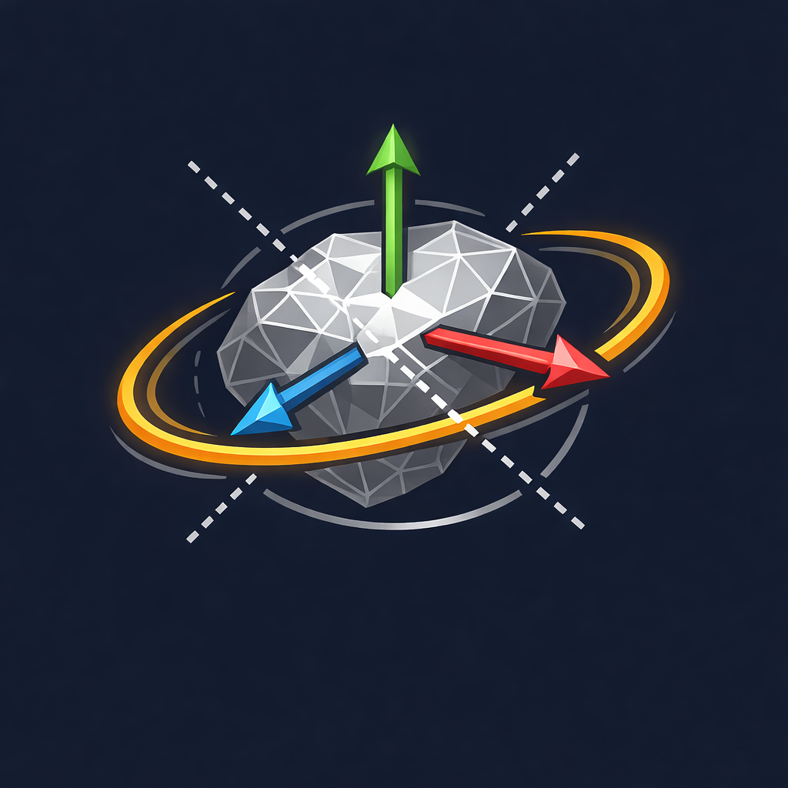

# STLander



STLander is a small Python package (SciPy + PyVista + **PySide6**) for aligning and visualizing
STL surface meshes. It provides both a command-line interface (CLI) and a Qt GUI.

- Load an STL
- Translate its **surface** center of mass (COM) to the origin
- Rotate so **principal axes** align with global **XYZ**
- Visualize **original vs aligned** side-by-side
- Switch camera modes, rendering styles, and save the aligned STL

## Contents

- Package: `stlander` (contains `core.py`, `cli.py`, `gui_qt.py`, `__main__.py`)
- Entry points: `stlander` command (GUI) and `stlander align` (CLI)

## Install (editable)

```bash
python -m pip install -U pip
pip install -e .
```

## Usage

Run the GUI:

```bash
stlander
# or explicitly:
stlander gui
```

Run via CLI:

```bash
stlander align input.stl output_aligned.stl
```

## Notes on COM / principal axes

STL files are surface meshes. This package computes an **area-weighted** COM and principal axes,
treating the surface as a thin shell with uniform areal density. For true volumetric mass properties
use a volumetric inertia approach (not currently included).

## GUI extras

- Quick camera views along **±X / ±Y / ±Z**
- Option to map 2nd principal axes **(PA2)** to **Y** (default) or **Z** (swap Y/Z)


## Creating a single EXE with PyInstaller (Windows)

Below are concise steps to create a single-file Windows executable including the project logo. Adjust
paths if you run commands from a different directory.

1) Build a CLI single-exe:

```powershell
pyinstaller --onefile --name STLander-CLI --add-data "logo.png;." --icon=logo.ico stlander\\__main__.py
```

2) Build a GUI single-exe (use `--windowed` to avoid a console window):

```powershell
pyinstaller --onefile --name STLander-GUI --add-data "logo.png;." --icon=logo.ico --windowed stlander\\__main__.py
```

Notes:
- On Windows the `--add-data` separator is `;` (as shown). On macOS/Linux use `:`.
- Run the above commands from the project root so imports resolve; you may need `--paths .` if PyInstaller
	can't find local modules.
- If the package uses non-Python resources, add them with `--add-data` or edit the generated `.spec` file
	to include data files and then run `pyinstaller your.spec`.
- If PyInstaller misses imports, add `--hidden-import modulename` for each missing module.

Example: after building, the single executable will be in the `dist/` directory (e.g. `dist\\STLander-GUI.exe`).

## Troubleshooting

- If the GUI exe launches but fails due to missing data files, open the generated `.spec` and ensure
	the `datas` list contains `('logo.png', '.')` (or equivalent path).
- For packaging with additional resources (icons, templates), prefer editing the `.spec` file and
	re-running `pyinstaller your.spec` for repeatable builds.

